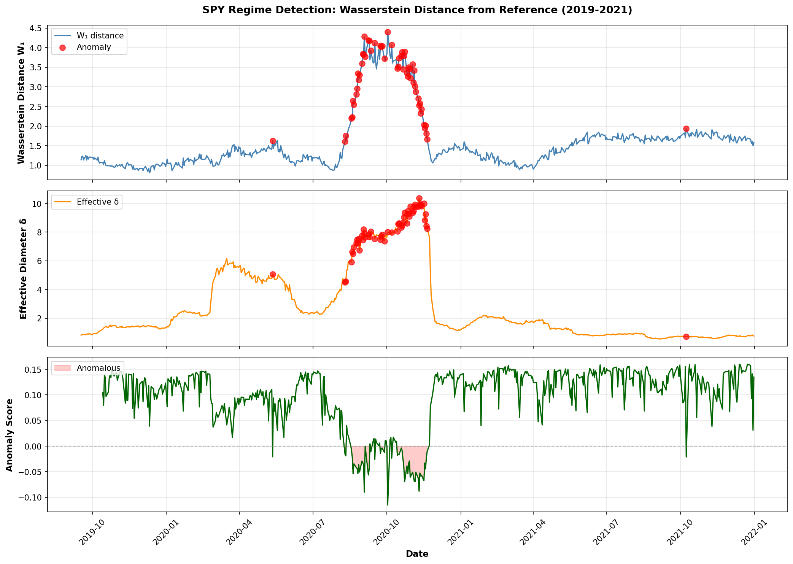
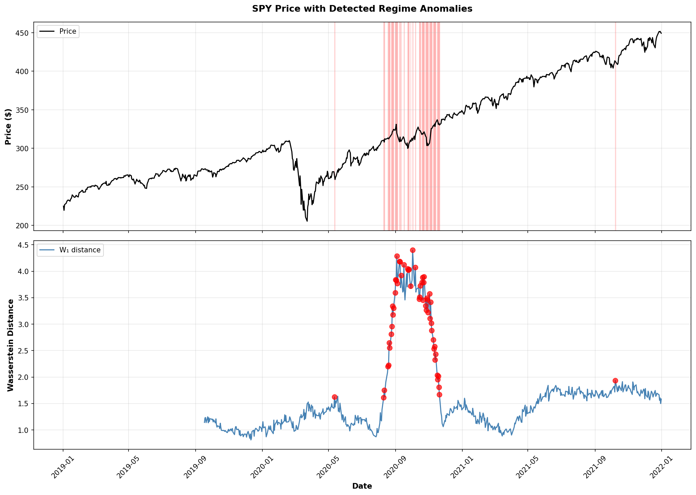
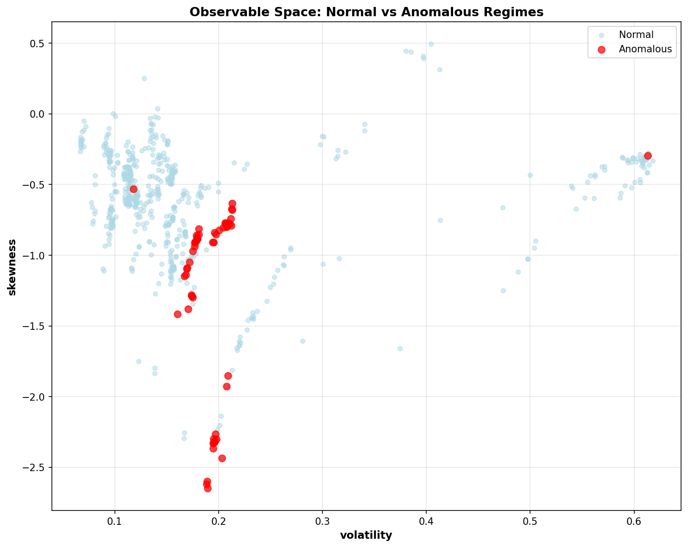

# Market Regime Detection via Optimal Transport

Detects market regime changes using Wasserstein distance to measure distribution shifts in financial time series.

## What It Does

1. Computes rolling statistical features (volatility, skewness, kurtosis, autocorrelation) from price data
2. Measures distribution shift using Wasserstein-1 (optimal transport) distance against a reference period
3. Flags anomalous periods using Isolation Forest when distributions deviate significantly

## Why Wasserstein Distance?

Traditional regime detection uses arbitrary thresholds ("20% drop = bear market") or HMMs with assumed state counts. This approach:

- **Continuous metric** - quantifies *how different* current conditions are, not just binary classification
- **Distribution-aware** - captures changes in volatility, skewness, tail behavior simultaneously
- **No assumed state count** - anomaly detection finds unusual periods without pre-specifying regime types

## Observable Features

The observable map Φ transforms price windows into statistical features:

```
Φ(prices) → [realized_vol, skewness, kurtosis, autocorr_1, hurst_exponent]
```

Rolling computation with configurable window (default: 60 days).

## Usage

```python
from regime_detector import RegimeDetector
import yfinance as yf

# Get data
spy = yf.download('SPY', start='2015-01-01', auto_adjust=True)

# Detect regimes
detector = RegimeDetector(window=60, reference_period=252)
detector.fit(spy['Close'], spy['Volume'])

# Results
print(detector.distance_df)  # Wasserstein distances over time
anomalies = detector.distance_df[detector.distance_df['anomaly']].index
```

## Visualizations


*Wasserstein distance over time with detected anomalies (red dots)*


*Price chart with anomalous periods highlighted*


*Observable space showing normal vs anomalous market conditions*

## Connection to Physics Research

This approach was adapted from research on stochastic universality classification ([ml-universality-classification](https://github.com/adamfbentley/ml-universality-classification)). The physics work proved that different growth processes (Edwards-Wilkinson, KPZ) produce separable distributions in observable space. 

The finance application is more heuristic—market "regimes" aren't mathematically proven universality classes—but the technique of measuring distribution divergence via optimal transport transfers directly.

## Requirements

```
numpy
pandas
scipy
scikit-learn
pot  # Python Optimal Transport
yfinance
matplotlib
```

## License

MIT
